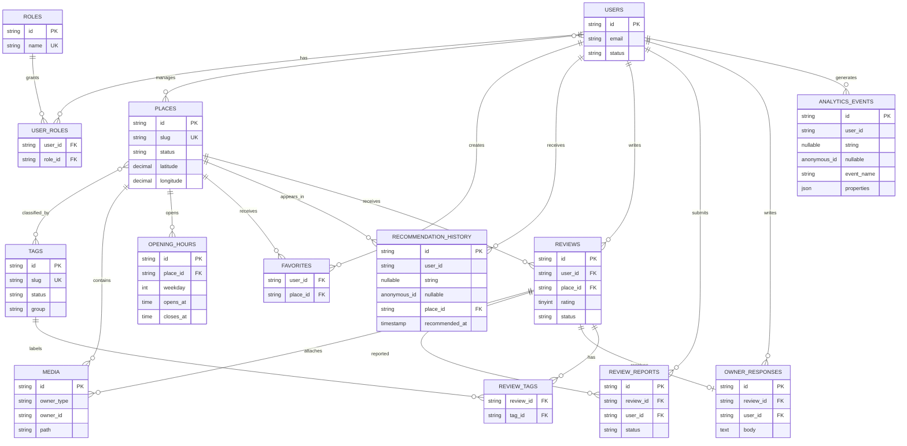

# Database ERD (Target)

Đây là thiết kế mục tiêu. Laravel migrations là nguồn thực thi khi schema được triển khai; các bảng dưới đây chưa đồng nghĩa với việc đã tồn tại trong scaffold.

Implementation note: the first recommendation slice uses a nullable JSON `places.tags` field in the scaffold migration. The normalized `tags`/pivot design above remains the target and must replace it in the taxonomy phase.

## Rules

- Public identifiers use ULID.
- Every place represents one branch/location in the MVP.
- Money is stored as integer VND; no floating-point money fields.
- Coordinates use WGS 84 decimal latitude/longitude.
- Published and non-deleted places are eligible for public recommendation.
- Recommendation history is retained for 30 days; raw analytics for 12 months.
- Relationship tables require unique constraints appropriate to their business rule, such as one favorite per user/place and one review per user/place.
- Proposed names above must be reconciled with actual migrations before implementation.
