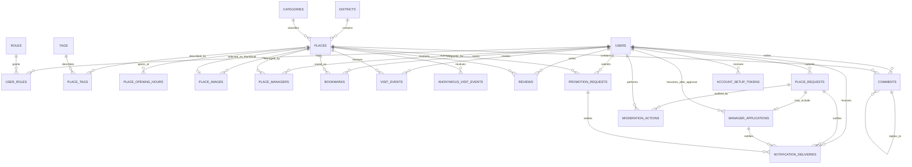
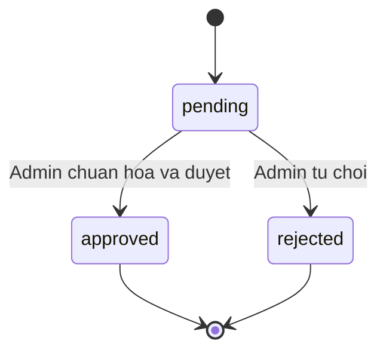
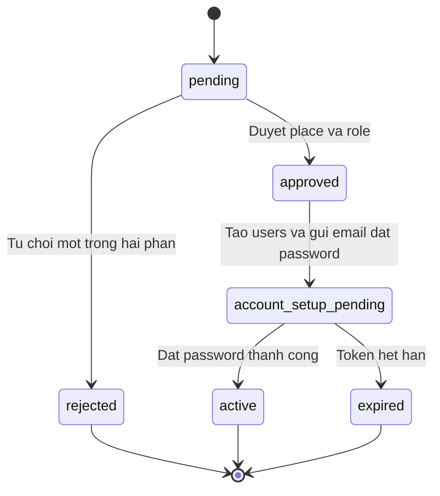
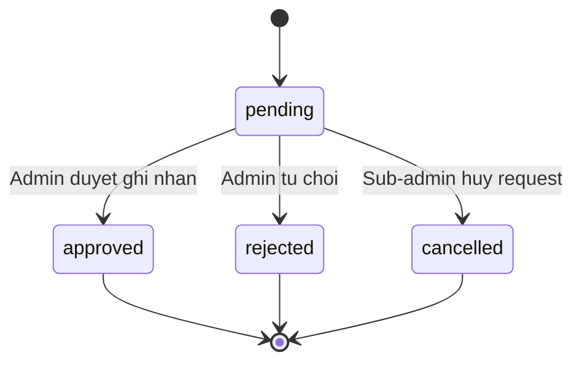

# ERD và thiết kế dữ liệu — HNAJ

- **Trạng thái:** Baseline đã triển khai, tiếp tục cập nhật theo thay đổi nghiệp vụ
- **Phiên bản:** 0.2
- **Cập nhật:** 2026-07-28
- **Nguồn nghiệp vụ:** [`docs/prd.md`](docs/prd.md:1)
- **Database mục tiêu:** MySQL 8.4 theo cấu hình Docker hiện tại

> Tài liệu này mô tả mô hình dữ liệu hiện hành theo PRD và migration trong `hnaj-be`. Các mục có đánh dấu **đề xuất** vẫn cần được xác nhận trước khi triển khai thêm.

## 1. Quy ước thiết kế

### 1.1. Kiểu dữ liệu chung

- Khóa chính dùng `BIGINT UNSIGNED` tự tăng theo convention Laravel.
- Foreign key dùng cùng kiểu với khóa chính được tham chiếu.
- Timestamps dùng `DATETIME` hoặc kiểu Laravel tương đương.
- Dữ liệu hiển thị công khai dùng `status` và `is_visible` hoặc cờ tương đương tùy bảng.
- Xóa mềm dùng `deleted_at` cho dữ liệu cần giữ lịch sử hoặc khôi phục.
- Tiền lưu bằng số nguyên VND, không lưu ký hiệu tiền tệ trong database.
- `places.min_price` và `places.max_price` là số nguyên không âm; `min_price <= max_price`.
- Rating dùng `DECIMAL(2,1)`, giá trị hợp lệ từ `1.0` đến `5.0`, bước `0.5`.
- Tọa độ dùng `DECIMAL(10,7)` cho latitude và `DECIMAL(10,7)` cho longitude.
- URL Google Maps lưu dạng text/url; tọa độ chuẩn hóa do Admin xác nhận từ request.

### 1.2. Quy tắc xóa và quan hệ

- Dữ liệu nghiệp vụ quan trọng không cascade delete tùy tiện.
- Foreign key giữa các bảng nghiệp vụ dùng hành vi restrict; việc xóa hoặc ẩn bản ghi phải được xử lý ở application.
- Bảng liên kết thuần túy như `user_roles` và `place_tags` chỉ được cascade khi bản ghi cha bị xóa cứng và policy cho phép.
- `places`, `users`, nội dung người dùng và request ưu tiên xóa mềm hoặc đổi trạng thái.
- Bookmark của place không active được ẩn bằng query trạng thái place, không xóa bản ghi bookmark.
- Category, tag và district không hỗ trợ xóa trong MVP.
- Mọi endpoint vẫn phải kiểm tra authorization ở backend, không dựa vào việc ẩn dữ liệu ở frontend.

## 2. ERD tổng thể

## 3. Data dictionary

### 3.1. Identity và authorization

#### `users`

Tài khoản đã tồn tại và có thể đăng nhập. Không tạo bản ghi khi gửi manager application.

| Cột | Kiểu logic | Null | Ràng buộc / ý nghĩa |
|---|---|---:|---|
| `id` | BIGINT UNSIGNED | Không | PK |
| `name` | VARCHAR | Không | Tên hiển thị |
| `email` | VARCHAR | Không | UNIQUE, dùng đăng nhập |
| `password` | VARCHAR | Không | Password hash; chỉ xuất hiện ở đây |
| `status` | VARCHAR | Không | `active`, `suspended`, `disabled`; application dùng constants hoặc PHP backed enum |
| `email_verified_at` | DATETIME | Có | Thời điểm xác thực email |
| `remember_token` | VARCHAR | Có | Theo cơ chế Laravel nếu dùng |
| `created_at`, `updated_at` | DATETIME | Không | Timestamps |
| `deleted_at` | DATETIME | Có | Xóa mềm nếu áp dụng |

#### `roles`

Danh mục role hệ thống.

| Cột | Kiểu logic | Null | Ràng buộc / ý nghĩa |
|---|---|---:|---|
| `id` | BIGINT UNSIGNED | Không | PK |
| `name` | VARCHAR | Không | UNIQUE; `user`, `sub_admin`, `admin` |
| `description` | TEXT | Có | Mô tả |
| `created_at`, `updated_at` | DATETIME | Không | Timestamps |

#### `user_roles`

Pivot cho phép một tài khoản có nhiều role.

| Cột | Kiểu logic | Null | Ràng buộc / ý nghĩa |
|---|---|---:|---|
| `user_id` | BIGINT UNSIGNED | Không | FK `users.id` |
| `role_id` | BIGINT UNSIGNED | Không | FK `roles.id` |
| `assigned_by` | BIGINT UNSIGNED | Có | FK `users.id`, Admin cấp role |
| `assigned_at` | DATETIME | Không | Thời điểm cấp |
| `created_at`, `updated_at` | DATETIME | Không | Timestamps |

**Unique:** `user_id + role_id`.

#### `account_setup_tokens`

Token một lần để ứng viên đặt password sau khi place và role được duyệt.

| Cột | Kiểu logic | Null | Ràng buộc / ý nghĩa |
|---|---|---:|---|
| `id` | BIGINT UNSIGNED | Không | PK |
| `user_id` | BIGINT UNSIGNED | Không | FK `users.id` |
| `token_hash` | CHAR hoặc VARCHAR | Không | Lưu hash token, không lưu token plaintext |
| `expires_at` | DATETIME | Không | Hạn dùng; mặc định 24 giờ sau khi phát hành |
| `used_at` | DATETIME | Có | Token đã dùng hoặc bị vô hiệu hóa |
| `created_at` | DATETIME | Không | Timestamps |

**Index:** `user_id`, `expires_at`; UNIQUE phù hợp trên `token_hash`.

### 3.2. Khu vực, place, category và tag

#### `districts`

Danh sách phẳng các quận, huyện và thị xã thuộc địa giới hành chính Hà Nội. Không lưu tỉnh/thành phố hoặc phường/xã; địa chỉ chi tiết được lưu riêng ở `places.address_text`.

| Cột | Kiểu logic | Null | Ràng buộc / ý nghĩa |
|---|---|---:|---|
| `id` | BIGINT UNSIGNED | Không | PK |
| `name` | VARCHAR | Không | Tên quận/huyện/thị xã |
| `code` | VARCHAR | Có | Mã hành chính nếu dùng |
| `status` | VARCHAR | Không | Active/inactive |
| `created_at`, `updated_at` | DATETIME | Không | Timestamps |

**Unique đề xuất:** `name`.

#### `places`

Địa điểm được chuẩn hóa để phục vụ random và trang công khai. Place từ seed được import thẳng với `status = active`; place từ request chỉ được tạo hoặc kích hoạt sau quy trình duyệt riêng của request.

| Cột | Kiểu logic | Null | Ràng buộc / ý nghĩa |
|---|---|---:|---|
| `id` | BIGINT UNSIGNED | Không | PK |
| `name` | VARCHAR | Không | Tên chuẩn hóa |
| `address_text` | VARCHAR hoặc TEXT | Không | Địa chỉ chi tiết hiển thị |
| `google_place_id` | VARCHAR | Có | UNIQUE; bắt buộc với seed, có thể null với place do User tạo |
| `phone` | VARCHAR | Có | Số điện thoại |
| `website_url` | TEXT | Có | Website của place |
| `google_maps_url` | TEXT | Không | Link mở Google Maps |
| `district_id` | BIGINT UNSIGNED | Không | FK `districts.id`; quận/huyện/thị xã Hà Nội |
| `category_id` | BIGINT UNSIGNED | Không | FK `categories.id`; đúng một category |
| `latitude` | DECIMAL(10,7) | Không | Tọa độ chuẩn hóa |
| `longitude` | DECIMAL(10,7) | Không | Tọa độ chuẩn hóa |
| `min_price` | UNSIGNED BIGINT | Có | Giá thấp nhất theo số nguyên VND; CSV import dùng trực tiếp giá AI đã chuẩn hóa |
| `max_price` | UNSIGNED BIGINT | Có | Giá cao nhất theo số nguyên VND; CSV import dùng trực tiếp giá AI đã chuẩn hóa |
| `description` | TEXT | Có | Mô tả |
| `thumbnail_image_id` | BIGINT UNSIGNED | Có | FK `place_images.id`; ảnh chính dùng cho card random |
| `status` | VARCHAR | Không | Chỉ `active` hoặc `hidden` |
| `created_by` | BIGINT UNSIGNED | Có | FK `users.id`; null với seed |
| `created_at`, `updated_at` | DATETIME | Không | Timestamps |
| `deleted_at` | DATETIME | Có | Xóa mềm |

**Index:** `status`, `district_id`, `category_id`, `google_place_id`, `min_price`, `max_price`, tọa độ. `google_place_id` unique nullable để seed có thể rerun idempotent; không unique theo tên hoặc tọa độ.

**Migration note:** `thumbnail_image_id` nullable được thêm FK sau khi tạo `place_images`, vì `place_images.place_id` đồng thời tham chiếu ngược về `places`.

#### `categories`

Danh mục place.

| Cột | Kiểu logic | Null | Ràng buộc / ý nghĩa |
|---|---|---:|---|
| `id` | BIGINT UNSIGNED | Không | PK |
| `name` | VARCHAR | Không | Tên category |
| `slug` | VARCHAR | Không | UNIQUE |
| `status` | VARCHAR | Không | Active/inactive |
| `created_at`, `updated_at` | DATETIME | Không | Timestamps |
| `deleted_at` | DATETIME | Có | Xóa mềm nếu cần |

#### `tags`

Tag mô tả place.

| Cột | Kiểu logic | Null | Ràng buộc / ý nghĩa |
|---|---|---:|---|
| `id` | BIGINT UNSIGNED | Không | PK |
| `name` | VARCHAR | Không | Tên tag |
| `slug` | VARCHAR | Không | UNIQUE |
| `status` | VARCHAR | Không | Active/inactive |
| `created_at`, `updated_at` | DATETIME | Không | Timestamps |
| `deleted_at` | DATETIME | Có | Xóa mềm nếu cần |

#### `place_tags`

Tag thực tế được gán cho place. Tag độc lập với category; category và tag là hai chiều phân loại/filter riêng.

| Cột | Kiểu logic | Null | Ràng buộc / ý nghĩa |
|---|---|---:|---|
| `place_id` | BIGINT UNSIGNED | Không | FK `places.id` |
| `tag_id` | BIGINT UNSIGNED | Không | FK `tags.id` |
| `created_at`, `updated_at` | DATETIME | Không | Timestamps |

**Unique:** `place_id + tag_id`.

### 3.3. Nội dung place và quyền quản lý

#### `place_opening_hours`

Khung giờ theo ngày trong tuần. Ngày không có dữ liệu hợp lệ thì không tạo row và được hiểu là `unknown`, không mặc định là đóng cửa.

| Cột | Kiểu logic | Null | Ràng buộc / ý nghĩa |
|---|---|---:|---|
| `id` | BIGINT UNSIGNED | Không | PK |
| `place_id` | BIGINT UNSIGNED | Không | FK `places.id` |
| `day_of_week` | TINYINT UNSIGNED | Không | 2–8 theo quy ước ứng dụng: 2=Thứ Hai, ..., 8=Chủ Nhật |
| `schedule_type` | VARCHAR | Không | `regular`, `all_day`, `closed` |
| `opens_at` | TIME | Có | Bắt buộc khi `schedule_type = regular`; ứng dụng dùng `HH:MM` |
| `closes_at` | TIME | Có | Bắt buộc khi `schedule_type = regular`; ứng dụng dùng `HH:MM` |
| `created_at`, `updated_at` | DATETIME | Không | Timestamps |

Có thể có nhiều slot trong một ngày. `all_day` và `closed` không cần giờ mở/đóng. Ngày lễ/ngoại lệ không thuộc phạm vi.

**Index:** `place_id + day_of_week`.

#### `place_images`

Bộ ảnh thống nhất của place, lưu URL công khai. Không phân biệt menu và gallery trong database; ảnh menu nếu có cũng là một ảnh trong bộ ảnh này.

| Cột | Kiểu logic | Null | Ràng buộc / ý nghĩa |
|---|---|---:|---|
| `id` | BIGINT UNSIGNED | Không | PK |
| `place_id` | BIGINT UNSIGNED | Không | FK `places.id` |
| `uploaded_by` | BIGINT UNSIGNED | Có | FK `users.id`; null với ảnh seed |
| `image_url` | TEXT | Không | URL công khai; seed dùng CSV thumbnail URL |
| `alt_text` | VARCHAR | Có | Mô tả ảnh |
| `is_visible` | BOOLEAN | Không | Admin có thể ẩn |
| `created_at`, `updated_at` | DATETIME | Không | Timestamps |
| `deleted_at` | DATETIME | Có | Xóa mềm |

`places.thumbnail_image_id` chọn ảnh chính. Khi xóa ảnh đang được chọn, application phải đặt `places.thumbnail_image_id = NULL` trước khi xóa/soft-delete ảnh. Ảnh thumbnail phải thuộc cùng place.

#### `place_managers`

Quan hệ nhiều-nhiều giữa Sub-admin và place.

| Cột | Kiểu logic | Null | Ràng buộc / ý nghĩa |
|---|---|---:|---|
| `place_id` | BIGINT UNSIGNED | Không | FK `places.id` |
| `user_id` | BIGINT UNSIGNED | Không | FK `users.id` |
| `assigned_by` | BIGINT UNSIGNED | Không | FK `users.id`, Admin |
| `assigned_at` | DATETIME | Không | Thời điểm cấp |
| `created_at`, `updated_at` | DATETIME | Không | Timestamps |
| `revoked_at` | DATETIME | Có | Thu hồi quyền quản lý |

**Unique đề xuất:** `place_id + user_id` cho quan hệ đang tồn tại hoặc dùng lịch sử assignment riêng nếu cần tái cấp.

### 3.4. Bookmark, visit và nội dung người dùng

#### `bookmarks`

Bookmark riêng tư của User.

| Cột | Kiểu logic | Null | Ràng buộc / ý nghĩa |
|---|---|---:|---|
| `id` | BIGINT UNSIGNED | Không | PK |
| `user_id` | BIGINT UNSIGNED | Không | FK `users.id` |
| `place_id` | BIGINT UNSIGNED | Không | FK `places.id` |
| `created_at`, `updated_at` | DATETIME | Không | Timestamps |

**Unique:** `user_id + place_id`.

#### `visit_events`

Visit của User đã đăng nhập. Chỉ tạo khi bấm “Đi tới đó”.

| Cột | Kiểu logic | Null | Ràng buộc / ý nghĩa |
|---|---|---:|---|
| `id` | BIGINT UNSIGNED | Không | PK |
| `user_id` | BIGINT UNSIGNED | Không | FK `users.id` |
| `place_id` | BIGINT UNSIGNED | Không | FK `places.id` |
| `visit_date` | DATE | Không | Ngày nghiệp vụ để deduplicate |
| `visited_at` | DATETIME | Không | Thời điểm click đầu tiên trong ngày |
| `source` | VARCHAR | Có | Discovery, detail hoặc nguồn khác |
| `created_at`, `updated_at` | DATETIME | Không | Timestamps |

**Unique:** `user_id + place_id + visit_date`.

#### `anonymous_visit_events`

Visit của khách chưa đăng nhập, dùng cho hot, không hiển thị trong lịch sử cá nhân.

| Cột | Kiểu logic | Null | Ràng buộc / ý nghĩa |
|---|---|---:|---|
| `id` | BIGINT UNSIGNED | Không | PK |
| `place_id` | BIGINT UNSIGNED | Không | FK `places.id` |
| `anonymous_key_hash` | CHAR hoặc VARCHAR | Không | Hash từ định danh tạm thời, không lưu IP thô |
| `visit_date` | DATE | Không | Ngày nghiệp vụ |
| `visited_at` | DATETIME | Không | Thời điểm ghi nhận |
| `source` | VARCHAR | Có | Nguồn click |
| `created_at`, `updated_at` | DATETIME | Không | Timestamps |

**Unique:** `place_id + anonymous_key_hash + visit_date`.

> `anonymous_key_hash` được tạo từ random ID trong cookie trình duyệt; không lưu IP thô. Cookie bị xóa hoặc hết hiệu lực thì trình duyệt được xem như anonymous visitor mới. Chính sách retention dài hạn có thể cấu hình ở tầng vận hành nhưng không thay đổi schema MVP.

#### `reviews`

Một rating/review của một User cho một place.

| Cột | Kiểu logic | Null | Ràng buộc / ý nghĩa |
|---|---|---:|---|
| `id` | BIGINT UNSIGNED | Không | PK |
| `user_id` | BIGINT UNSIGNED | Không | FK `users.id` |
| `place_id` | BIGINT UNSIGNED | Không | FK `places.id` |
| `rating` | DECIMAL(2,1) | Không | 1.0–5.0, bước 0.5 |
| `body` | TEXT | Có | Review không bắt buộc |
| `status` | VARCHAR | Không | `published`, `hidden`, `removed` |
| `created_at`, `updated_at` | DATETIME | Không | Timestamps |
| `deleted_at` | DATETIME | Có | Xóa mềm nếu User xóa |

**Unique:** `user_id + place_id`. Backend phải kiểm tra visit trước khi create/update.

Review có thể có nhiều ảnh trong `review_images`; review không có reply trực tiếp.

#### `review_images`

Ảnh đính kèm review, lưu URL công khai và xóa mềm.

| Cột | Kiểu logic | Null | Ràng buộc / ý nghĩa |
|---|---|---:|---|
| `id` | BIGINT UNSIGNED | Không | PK |
| `review_id` | BIGINT UNSIGNED | Không | FK `reviews.id`, xóa ảnh khi xóa review |
| `image_url` | TEXT | Không | URL công khai |
| `alt_text` | VARCHAR | Có | Mô tả ảnh |
| `sort_order` | SMALLINT UNSIGNED | Không | Thứ tự hiển thị, mặc định 0 |
| `created_at`, `updated_at` | DATETIME | Không | Timestamps |
| `deleted_at` | DATETIME | Có | Xóa mềm |

**Index:** `review_id + sort_order`.

#### `comments`

Comment/câu hỏi của User và reply của Sub-admin/Admin.

| Cột | Kiểu logic | Null | Ràng buộc / ý nghĩa |
|---|---|---:|---|
| `id` | BIGINT UNSIGNED | Không | PK |
| `place_id` | BIGINT UNSIGNED | Không | FK `places.id` |
| `user_id` | BIGINT UNSIGNED | Không | FK `users.id`, người tạo |
| `parent_id` | BIGINT UNSIGNED | Có | Self FK `comments.id`, reply/thread |
| `body` | TEXT | Không | Nội dung |
| `status` | VARCHAR | Không | `published`, `hidden`, `removed` |
| `created_at`, `updated_at` | DATETIME | Không | Timestamps |
| `deleted_at` | DATETIME | Có | Xóa mềm |

Sub-admin chỉ được reply comment thuộc place mình quản lý. Admin có quyền moderation.

Comment có thể có nhiều ảnh trong `comment_images`.

#### `comment_images`

Ảnh đính kèm comment, lưu URL công khai và xóa mềm.

| Cột | Kiểu logic | Null | Ràng buộc / ý nghĩa |
|---|---|---:|---|
| `id` | BIGINT UNSIGNED | Không | PK |
| `comment_id` | BIGINT UNSIGNED | Không | FK `comments.id`, xóa ảnh khi xóa comment |
| `image_url` | TEXT | Không | URL công khai |
| `alt_text` | VARCHAR | Có | Mô tả ảnh |
| `sort_order` | SMALLINT UNSIGNED | Không | Thứ tự hiển thị, mặc định 0 |
| `created_at`, `updated_at` | DATETIME | Không | Timestamps |
| `deleted_at` | DATETIME | Có | Xóa mềm |

**Index:** `comment_id + sort_order`.

### 3.5. Request và approval

#### `place_requests`

Request thêm place do User gửi; Admin tự xem xét trùng và chuẩn hóa trước publish.

| Cột | Kiểu logic | Null | Ràng buộc / ý nghĩa |
|---|---|---:|---|
| `id` | BIGINT UNSIGNED | Không | PK |
| `submitted_by` | BIGINT UNSIGNED | Không | FK `users.id` |
| `place_id` | BIGINT UNSIGNED | Có | FK `places.id`, được gắn sau khi Admin chuẩn hóa/duyệt place mới |
| `name_input` | VARCHAR | Không | Dữ liệu gốc |
| `google_maps_url_input` | TEXT | Không | Dữ liệu gốc |
| `address_text_input` | TEXT | Không | Dữ liệu gốc |
| `category_id_input` | BIGINT UNSIGNED | Không | FK `categories.id`; category duy nhất được User đề xuất |
| `source_image_path` | VARCHAR | Có | Ảnh đính kèm nếu có |
| `normalized_data` | JSON | Có | Dữ liệu Admin chuẩn hóa trước publish |
| `status` | VARCHAR | Không | `pending`, `approved`, `rejected` |
| `reviewed_by` | BIGINT UNSIGNED | Có | FK `users.id`, Admin |
| `reviewed_at` | DATETIME | Có | Thời điểm duyệt |
| `review_reason` | TEXT | Có | Lý do reject hoặc ghi chú |
| `created_at`, `updated_at` | DATETIME | Không | Timestamps |

**Index:** `status`, `submitted_by`, `place_id`.

#### `manager_applications`

Đơn xin làm Sub-admin cho place mới. MVP không hỗ trợ xin quản lý place đã tồn tại. Không lưu password và không tạo `users` khi submit.

| Cột | Kiểu logic | Null | Ràng buộc / ý nghĩa |
|---|---|---:|---|
| `id` | BIGINT UNSIGNED | Không | PK |
| `place_request_id` | BIGINT UNSIGNED | Không | FK `place_requests.id`; request phải là place mới trong MVP |
| `email` | VARCHAR | Không | Email dự kiến, không nhất thiết là User hiện tại |
| `representative_name` | VARCHAR | Không | Người đại diện |
| `proof_reference` | VARCHAR hoặc TEXT | Có | Tham chiếu giấy tờ, không lưu dữ liệu nhạy cảm tùy tiện |
| `status` | VARCHAR | Không | `pending`, `approved`, `rejected` |
| `approved_user_id` | BIGINT UNSIGNED | Có | FK `users.id`, set sau khi approved và tạo account |
| `reviewed_by` | BIGINT UNSIGNED | Có | FK `users.id`, Admin |
| `reviewed_at` | DATETIME | Có | Thời điểm duyệt |
| `review_reason` | TEXT | Có | Lý do |
| `created_at`, `updated_at` | DATETIME | Không | Timestamps |

**Không có cột:** `password`, `password_hash` hoặc plaintext credential.

#### `promotion_requests`

Request quảng bá do Sub-admin gửi. MVP chỉ ghi nhận request và quyết định của Admin; chưa triển khai placement, vị trí, nhãn, thời hạn, package, phí hoặc thanh toán.

| Cột | Kiểu logic | Null | Ràng buộc / ý nghĩa |
|---|---|---:|---|
| `id` | BIGINT UNSIGNED | Không | PK |
| `place_id` | BIGINT UNSIGNED | Không | FK `places.id` |
| `submitted_by` | BIGINT UNSIGNED | Không | FK `users.id` |
| `status` | VARCHAR | Không | `pending`, `approved`, `rejected`, `cancelled` |
| `reviewed_by` | BIGINT UNSIGNED | Có | FK `users.id`, Admin |
| `reviewed_at` | DATETIME | Có | Thời điểm duyệt |
| `review_reason` | TEXT | Có | Lý do |
| `created_at`, `updated_at` | DATETIME | Không | Timestamps |

### 3.6. Moderation và email

#### `moderation_actions`

Audit tối thiểu cho thao tác Admin trên request/nội dung. Không dùng để lưu lịch sử cập nhật thông thường của Sub-admin.

| Cột | Kiểu logic | Null | Ràng buộc / ý nghĩa |
|---|---|---:|---|
| `id` | BIGINT UNSIGNED | Không | PK |
| `performed_by` | BIGINT UNSIGNED | Không | FK `users.id` |
| `target_type` | VARCHAR | Không | Polymorphic type ổn định |
| `target_id` | BIGINT UNSIGNED | Không | ID bản ghi mục tiêu |
| `action` | VARCHAR | Không | `approve`, `reject`, `hide`, `remove`, `restore` |
| `reason` | TEXT | Có | Lý do |
| `metadata` | JSON | Có | Dữ liệu bổ sung không nhạy cảm |
| `created_at` | DATETIME | Không | Thời điểm thao tác |

**Index:** `target_type + target_id`, `performed_by`, `created_at`.

#### `notification_deliveries`

Theo dõi email nghiệp vụ đã yêu cầu và gửi, không lưu secret.

| Cột | Kiểu logic | Null | Ràng buộc / ý nghĩa |
|---|---|---:|---|
| `id` | BIGINT UNSIGNED | Không | PK |
| `user_id` | BIGINT UNSIGNED | Có | FK `users.id`, nếu người nhận đã có account |
| `recipient_email` | VARCHAR | Không | Email nhận tại thời điểm gửi |
| `notifiable_type` | VARCHAR | Không | Loại request liên quan |
| `notifiable_id` | BIGINT UNSIGNED | Không | ID request liên quan |
| `notification_type` | VARCHAR | Không | `request_approved`, `request_rejected`, `account_setup` |
| `status` | VARCHAR | Không | `pending`, `sent`, `failed` |
| `sent_at` | DATETIME | Có | Thời điểm gửi thành công |
| `failure_reason` | TEXT | Có | Không lưu secret hoặc nội dung nhạy cảm |
| `created_at`, `updated_at` | DATETIME | Không | Timestamps |

## 4. State transition

### 4.1. Place request

Điều kiện `approved`:

- Admin đã xem xét khả năng trùng thủ công.
- Dữ liệu đã được chuẩn hóa.
- Place mới được tạo hoặc kích hoạt.
- Email kết quả được enqueue.

### 4.2. Manager application

Quy tắc:

- Không tạo `users` khi application ở `pending`.
- Chỉ khi place và manager application cùng được duyệt mới tạo `users`, gán role và `place_managers`.
- Password do ứng viên tự đặt qua token một lần gửi email.
- Token chỉ lưu hash và phải có hạn dùng.

### 4.3. Promotion request

MVP chưa có `promotion_placements`; package, nhãn, vị trí, thời hạn, phí và thanh toán là phạm vi mở rộng sau này.

## 5. Ràng buộc nghiệp vụ và index chính

| Nhóm | Ràng buộc |
|---|---|
| User | `users.email` unique; password chỉ nằm ở `users` |
| Role | `user_roles.user_id + role_id` unique |
| Place | `category_id` bắt buộc; status chỉ `active` hoặc `hidden`; `google_place_id` unique nullable |
| Price | `min_price` và `max_price` cùng null hoặc cùng là số nguyên VND không âm; min không lớn hơn max |
| Area | `district_id` thuộc danh sách quận/huyện/thị xã Hà Nội |
| Category/tag | `place_tags` không trùng; category và tag độc lập, tag phải active khi được gán mới |
| Opening hours | `regular`, `all_day`, `closed`; nhiều slot/ngày; hỗ trợ `crosses_midnight`; ngày thiếu là unknown |
| Images | `thumbnail_image_id` nullable và phải trỏ tới ảnh cùng place; xóa thumbnail thì set null |
| Bookmark | `user_id + place_id` unique |
| Visit User | `user_id + place_id + visit_date` unique |
| Visit anonymous | `place_id + anonymous_key_hash + visit_date` unique; key lấy từ cookie random ID |
| Review | `user_id + place_id` unique; phải có visit trước khi ghi |
| Comment | `parent_id` tự tham chiếu; backend kiểm tra quyền reply |
| Manager application | Không có password; MVP chỉ áp dụng cho place mới; chỉ tạo account sau khi approved |
| Promotion | MVP chỉ lưu request và quyết định Admin; chưa có placement |
| Email | Token và nội dung nhạy cảm không lưu plaintext; account setup token hiệu lực 24 giờ và dùng một lần |

## 6. Các điểm đã chốt trước migration

1. **Anonymous visit:** dùng cookie trình duyệt chứa random ID; chỉ lưu hash trong `anonymous_visit_events`, không lưu IP thô. Unique theo `place_id + anonymous_key_hash + visit_date`; xóa/hết hạn cookie được xem như khách mới.
2. **Account setup token:** hiệu lực 24 giờ, chỉ dùng một lần; token cũ bị vô hiệu hóa khi tạo token mới; ứng viên có thể yêu cầu gửi lại email sau khi hết hạn.
3. **Status implementation:** dùng `VARCHAR` kết hợp constants hoặc PHP backed enum ở application; không dùng MySQL `ENUM`.
4. **Moderation target:** giữ polymorphic `target_type + target_id`, giới hạn bằng class mapping cố định ở application và tạo index kết hợp.
5. **Place request attachment:** MVP chỉ hỗ trợ một ảnh qua `place_requests.source_image_path`; không tạo `place_request_images`.
6. **Manager application trên place đã có:** không hỗ trợ trong MVP; chỉ đăng ký quản lý place mới trong cùng `place_request`.
7. **Quảng bá:** MVP chỉ tạo `promotion_requests` để Admin xem xét và quyết định; chưa tạo `promotion_placements`, package, nhãn, vị trí, thời hạn, phí hoặc thanh toán.

## 7. Phạm vi triển khai tiếp theo

Sau khi tài liệu này được duyệt:

1. Tách data dictionary thành migration checklist.
2. Tạo migrations theo thứ tự dependency.
3. Tạo model, relation, cast và factory cần thiết.
4. Bổ sung test constraint, state transition và seed pipeline.
5. Chưa chạy migration destructive hoặc reset dữ liệu.
