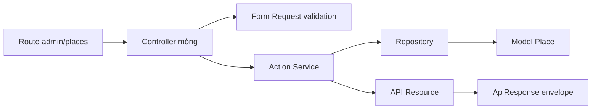
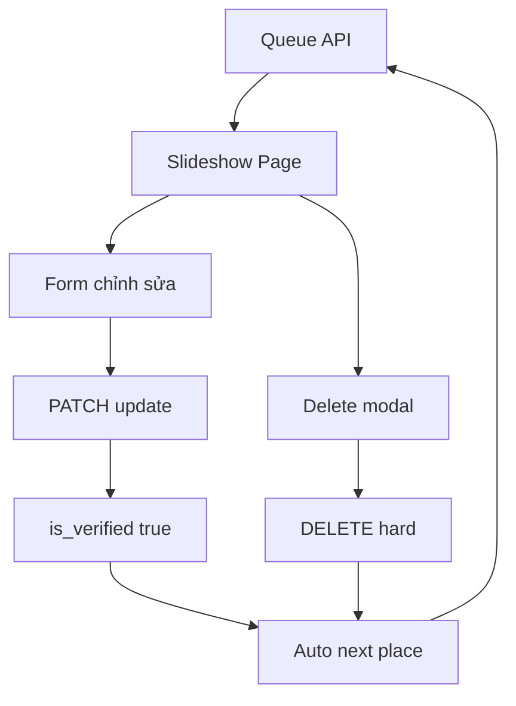

# Kế hoạch: Admin kiểm duyệt thủ công Places dạng slideshow

- **Ngày:** 2026-08-11
- **Trạng thái:** Chờ duyệt trước khi chuyển sang Code mode
- **Nguồn:** Yêu cầu làm sạch data rác, thêm cờ `is_verified`, giao diện admin duyệt lần lượt
- **Tiến độ tổng:** [`plans/project-progress.md`](plans/project-progress.md:1)

## 1. Mục tiêu và phạm vi

### Mục tiêu
Cho phép admin lần lượt xem, chỉnh sửa toàn bộ thông tin `places` hoặc hard-delete vĩnh viễn, trên giao diện slideshow tại dashboard admin. Mỗi lần cập nhật thành công tự đánh dấu `is_verified = true` và chuyển sang place chưa xác minh tiếp theo. Sau migration, mọi API public chỉ trả `is_verified = true`.

### Ngoài phạm vi
- Không upload file ảnh thật ở MVP; chỉ nhập/sửa URL, xóa ảnh, chọn thumbnail. S3 sẽ dùng sau nhưng vẫn lưu URL tương tự.
- Không thêm nút bỏ qua; không giữ place ở hàng đợi sau khi đã update.
- Không áp dụng cho user thường; chỉ admin.

### Quyết định đã chốt với người dùng
- Hard-delete vĩnh viễn kèm hộp thoại xác nhận đúng tên place.
- Update thành công tự `is_verified = true` và auto-next.
- Phạm vi field: toàn bộ place gồm `name`, `address_text`, `district_id`, `category_id`, `tags`, `phone`, `website_url`, `google_maps_url`, `latitude`, `longitude`, `min_price`, `max_price`, `description`, `status`, `opening_hours`, `images` bằng URL và `thumbnail_image_id`.
- Ảnh MVP chỉ URL, chưa dùng `Storage`.
- Public API sau migration chỉ trả verified.

## 2. Hành vi hiện tại và mong muốn

| Khu vực | Hiện tại | Mong muốn |
|---|---|---|
| DB `places` | Chưa có `is_verified`; [`hnaj-be/app/Models/Place.php`](hnaj-be/app/Models/Place.php:18) fillable không có cờ | Thêm `is_verified boolean default false index`, cast boolean, fillable |
| Public discovery/search | [`hnaj-be/app/Repositories/PlaceQuery.php`](hnaj-be/app/Repositories/PlaceQuery.php:1) và [`hnaj-be/app/Repositories/PlaceSearchRepository.php`](hnaj-be/app/Repositories/PlaceSearchRepository.php:1) chưa lọc verified | Thêm `where is_verified = true` cho mọi query public |
| Admin API | Chỉ có [`hnaj-be/routes/api.php`](hnaj-be/routes/api.php:74) login/me/logout | Thêm nhóm `admin/places` với queue, detail, update, hard-delete |
| Admin UI | [`hnaj-fe/src/pages/AdminDashboardPage.tsx`](hnaj-fe/src/pages/AdminDashboardPage.tsx:1) chỉ chào và đăng xuất | Thêm slideshow/form chỉnh sửa toàn bộ place, điều hướng prev/next, progress, empty/loading/error, modal xóa xác nhận tên |
| Ảnh | [`hnaj-be/app/Models/PlaceImage.php`](hnaj-be/app/Models/PlaceImage.php:14) lưu `image_url` text | Admin CRUD ảnh bằng URL trong cùng PATCH, chọn thumbnail |

## 3. Thiết kế database và model

### Migration mới
Tạo [`hnaj-be/database/migrations/2026_08_11_000034_add_is_verified_to_places_table.php`](hnaj-be/database/migrations/2026_08_11_000034_add_is_verified_to_places_table.php:1):
```php
Schema::table('places', function (Blueprint $table): void {
    $table->boolean('is_verified')->default(false)->after('status');
    $table->index('is_verified');
    $table->index(['is_verified', 'id']);
});
```
`down()` drop index và column. Không đổi dữ liệu hiện có; toàn bộ place cũ sẽ `false` và tạm biến mất khỏi public cho đến khi duyệt — đã được người dùng xác nhận.

### Model
- [`hnaj-be/app/Models/Place.php`](hnaj-be/app/Models/Place.php:38): thêm `is_verified` vào `fillable` và `casts` boolean.
- [`hnaj-be/database/factories/PlaceFactory.php`](hnaj-be/database/factories/PlaceFactory.php:20): thêm state `verified()` và `unverified()` để test.

### Index và query
Hàng đợi admin: `where is_verified = false order by id asc`. Public: `where is_verified = true` kết hợp với `status = active` hiện có.

## 4. Contract API

Tất cả endpoint dưới `prefix admin` yêu cầu `auth:sanctum` và `role:admin`, throttle riêng, trả envelope [`hnaj-be/app/Http/Responses/ApiResponse.php`](hnaj-be/app/Http/Responses/ApiResponse.php:9).

### 4.1 Danh sách hàng đợi kiểm duyệt
`GET /api/admin/places/verification-queue`
- Query: `page`, `per_page` 1..50 default 1 cho slideshow hoặc 10 cho list, `q` search name/address, `district_id`, `category_id`, `tag_id`
- Trả `data: AdminPlaceResource[]`, `meta: {current_page, last_page, per_page, total, total_unverified}`
- Sắp xếp `id asc` để duyệt lần lượt ổn định.

### 4.2 Chi tiết admin
`GET /api/admin/places/{place}`
- Trả `AdminPlaceResource` với `district`, `category`, `tags`, `openingHours`, `images`, `thumbnail`, `is_verified`, `status`, tọa độ, giá, URL, mô tả.
- 404 nếu không tồn tại.

### 4.3 Cập nhật và xác minh
`PATCH /api/admin/places/{place}`
- Body JSON chứa toàn bộ field cho phép sửa. Validation qua `UpdateAdminPlaceRequest`:
  - `name: required string max 255`
  - `address_text: required string`
  - `district_id: required exists districts id where status active`
  - `category_id: required exists categories id where status active`
  - `tag_ids: array max 20, exists tags id`
  - `phone: nullable string max 50`
  - `website_url: nullable url max 2048`
  - `google_maps_url: required url max 2048`
  - `latitude: required numeric between -90 90`
  - `longitude: required numeric between -180 180`
  - `min_price: nullable integer min 0`
  - `max_price: nullable integer min 0 gte min_price`
  - `description: nullable string max 5000`
  - `status: required in active,hidden`
  - `opening_hours: array size 7, mỗi phần tử {day_of_week 0..6, schedule_type in regular,all_day,closed, opens_at HH:MM nullable, closes_at HH:MM nullable}`
  - `images: array max 20, mỗi {id nullable exists place_images, image_url required url, alt_text nullable string max 255}`
  - `thumbnail_image_id: nullable exists place_images id thuộc place`
  - `deleted_image_ids: array ids cần xóa`
- Xử lý trong transaction: update `places`, sync `place_tags`, replace `place_opening_hours`, upsert/delete `place_images`, cập nhật `thumbnail_image_id`, cuối cùng `is_verified = true`.
- Trả `success true`, `data: AdminPlaceResource` đã verified, `meta: {next_unverified_id}` để FE auto-next.

### 4.4 Hard-delete vĩnh viễn
`DELETE /api/admin/places/{place}`
- Không có request body.
- Frontend hiển thị popup xác nhận trước khi gọi API; backend vẫn bắt buộc Bearer token và role admin.
- Xử lý trong `DB::transaction` với thứ tự xóa do FK `restrictOnDelete`:
  1. `review_images` và `comment_images` của place
  2. `reviews` và `comments` (xóa comment con trước cha)
  3. `bookmarks`, `visit_events`, `anonymous_visit_events`, `place_managers`, `promotion_requests`, `place_requests` nullable, `place_tags`, `place_opening_hours`
  4. Đặt `places.thumbnail_image_id = null` rồi xóa `place_images`
  5. `forceDelete` place
- Trả 204 hoặc `success true` với `meta next_unverified_id`.

### 4.5 Tài liệu
Cập nhật [`docs/api-response-contract.md`](docs/api-response-contract.md:1) không đổi, thêm [`docs/api-admin-places.md`](docs/api-admin-places.md:1) mô tả 4 endpoint trên, ví dụ request/response và các mã lỗi áp dụng như `VALIDATION_ERROR`, `NOT_FOUND`.

## 5. Kiến trúc backend Laravel

Tuân thủ `Route → Controller → Service/Action → Repository → Model` và `Form Request → Resource`.



### Files dự kiến
- `app/Http/Requests/Admin/Place/UpdateAdminPlaceRequest.php`
- `app/Http/Controllers/Api/Admin/Place/AdminPlaceVerificationQueueController.php`
- `app/Http/Controllers/Api/Admin/Place/AdminPlaceShowController.php`
- `app/Http/Controllers/Api/Admin/Place/AdminPlaceUpdateController.php`
- `app/Http/Controllers/Api/Admin/Place/AdminPlaceDestroyController.php`
- `app/Actions/Admin/Place/GetVerificationQueue.php`
- `app/Actions/Admin/Place/UpdateVerifiedPlace.php`
- `app/Actions/Admin/Place/HardDeletePlace.php`
- `app/Repositories/AdminPlaceRepository.php`
- `app/Http/Resources/AdminPlaceResource.php`
- `app/Http/Resources/AdminPlaceCollection.php` nếu cần meta riêng

### Repository chi tiết
- `AdminPlaceRepository::queue` paginate unverified với eager `district, category, tags, images, openingHours, thumbnail`.
- `AdminPlaceRepository::findForAdmin` load full.
- Public repositories thêm scope `verified()`.

### Lưu ý tương thích ngược
Public API sẽ trả rỗng cho đến khi có place verified; đây là hành vi mong muốn đã chốt. Không breaking cho admin vì endpoint mới.

## 6. Thiết kế frontend React

### Route và service
- Giữ [`hnaj-fe/src/routes/AppRoutes.tsx`](hnaj-fe/src/routes/AppRoutes.tsx:31) guard `RequireRole role admin`, thêm route `/admin/places/verification` hoặc mở rộng `/admin` với tab.
- Tạo [`hnaj-fe/src/services/adminPlaceService.ts`](hnaj-fe/src/services/adminPlaceService.ts:1) dùng [`hnaj-fe/src/services/httpClient.ts`](hnaj-fe/src/services/httpClient.ts:43) và `adminTokenStorage`:
  - `getVerificationQueue(params, signal)`
  - `getAdminPlace(id, signal)`
  - `updateAdminPlace(id, payload)`
  - `deleteAdminPlace(id, confirmName)`

### Màn hình slideshow
Tạo [`hnaj-fe/src/pages/AdminPlaceVerificationPage.tsx`](hnaj-fe/src/pages/AdminPlaceVerificationPage.tsx:1) và components:
- `AdminPlaceSlideshow` điều hướng prev/next, progress `X / total`, keyboard ArrowLeft/Right, auto-next sau update/delete.
- `AdminPlaceForm` chia section: Thông tin chung, Phân loại, Giá, Tọa độ, Liên hệ, Giờ mở cửa 7 ngày, Ảnh URL list, Thumbnail chọn.
- `DeletePlaceConfirmModal` yêu cầu nhập đúng tên place, disable nút xóa cho đến khi khớp, hiển thị cảnh báo destructive.

### State UX bắt buộc
- Loading skeleton khi fetch queue/detail >300ms
- Error với retry
- Empty khi `total_unverified = 0` hiển thị thông báo và CTA về dashboard
- Success toast sau update/delete và chuyển slide
- Permission: redirect `/admin/login` nếu 401/403

### Styling và responsive
- Dùng token từ [`design-system/hnaj/MASTER.md`](design-system/hnaj/MASTER.md:11), layout dense cho dashboard, không hard-code hex.
- Kiểm tra 375px, 768px, 1440px; form chuyển từ 1 cột sang 2 cột tại 60rem, slideshow controls luôn 44px hit target.
- Accessibility: label rõ, error gần field, focus ring, aria-live cho toast, modal trap focus.



## 7. Chiến lược hard-delete an toàn

- Chỉ admin; frontend phải hỏi xác nhận trước khi gửi DELETE.
- Transaction duy nhất, `forceDelete` để bỏ qua SoftDeletes.
- Thứ tự xóa đã liệt kê ở 4.4 để tránh vi phạm `restrictOnDelete` tại [`hnaj-be/database/migrations/2026_07_26_000010_create_places_table.php`](hnaj-be/database/migrations/2026_07_26_000010_create_places_table.php:19) và các migration liên quan.
- Không xóa `categories`, `districts`, `tags` gốc.
- Log moderation nếu cần nhưng không bắt buộc cho MVP tạm thời.

## 8. Kiểm chứng

### Backend trong Docker
```bash
cd hnaj-docker
docker compose --env-file .env ps
docker compose --env-file .env up -d
docker compose --env-file .env exec backend php artisan migrate --force
docker compose --env-file .env exec backend php artisan test --filter=AdminPlace
docker compose --env-file .env exec backend php artisan test
```

### Frontend trong Docker
```bash
cd hnaj-docker
docker compose --env-file .env exec frontend npm run lint
docker compose --env-file .env exec frontend npm run build
```

### Test dự kiến
- `AdminPlaceVerificationQueueTest`: auth, role, pagination, filter, chỉ unverified
- `AdminPlaceUpdateTest`: validation, sync tags/hours/images, set verified, transaction
- `AdminPlaceHardDeleteTest`: admin authorization, success không cần body, xóa cascade, thứ tự FK
- `PublicPlaceVerifiedScopeTest`: discovery/search không trả unverified
- Cập nhật `PlaceFactory` để seed verified/unverified

### QA UI
Mở `/admin/places/verification` bằng browser, chụp 375/768/1440 cho các trạng thái loading, error, empty, success, modal xóa, kiểm tra keyboard, focus, contrast, overflow, sau đó xóa ảnh tạm.

## 9. Rủi ro và giả định

- Giả định chưa có user thật nên hard-delete không ảnh hưởng history; nếu sau này có user, cần đánh giá lại.
- Rủi ro FK restrict: nếu thiếu thứ tự xóa sẽ lỗi 500; đã thiết kế transaction và test.
- Rủi ro đồng thời: hai admin mở cùng place; giải pháp MVP là last-write-wins, có thể thêm optimistic locking sau.
- Rủi ro public rỗng sau migration: đã được chấp nhận để đảm bảo data sạch.
- Ảnh URL: không validate tồn tại ảnh, chỉ validate URL format; S3 sau này vẫn tương thích.

## 10. Todo chi tiết cho Code mode

- [ ] Tạo migration `is_verified` và cập nhật [`hnaj-be/app/Models/Place.php`](hnaj-be/app/Models/Place.php:1)
- [ ] Cập nhật `PlaceQuery`, `PlaceSearchRepository`, `PlaceRepository` thêm scope verified cho public
- [ ] Tạo Form Requests, Actions, Repositories, Resources, Controllers admin và route trong [`hnaj-be/routes/api.php`](hnaj-be/routes/api.php:1)
- [ ] Viết Feature tests cho queue/update/delete/verified scope
- [ ] Tạo [`hnaj-fe/src/services/adminPlaceService.ts`](hnaj-fe/src/services/adminPlaceService.ts:1) và [`hnaj-fe/src/pages/AdminPlaceVerificationPage.tsx`](hnaj-fe/src/pages/AdminPlaceVerificationPage.tsx:1) với slideshow/form/modal
- [ ] Cập nhật [`hnaj-fe/src/routes/AppRoutes.tsx`](hnaj-fe/src/routes/AppRoutes.tsx:1) và style trong [`hnaj-fe/src/App.css`](hnaj-fe/src/App.css:1)
- [ ] Viết tài liệu [`docs/api-admin-places.md`](docs/api-admin-places.md:1) và cập nhật [`docs/erd.md`](docs/erd.md:1), [`docs/migration-checklist.md`](docs/migration-checklist.md:1)
- [ ] Chạy lint/build/test trong Docker và QA UI 3 viewport, xóa ảnh tạm

## 11. Phê duyệt

Vui lòng xác nhận kế hoạch này. Sau khi duyệt, sẽ chuyển sang Code mode để triển khai theo todo trên, không tự ý đổi contract, không chạy migration destructive khi chưa được phép rõ ràng.
