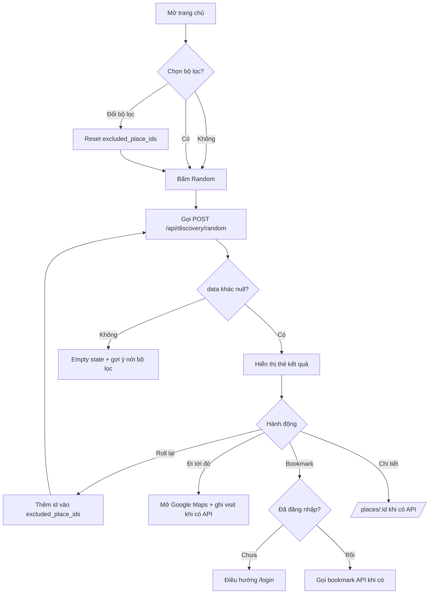
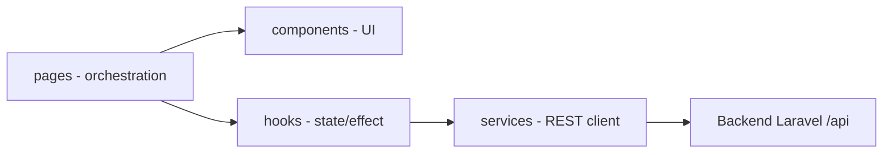

# Plan thiết kế UI HNAJ — áp dụng skill ui-ux-pro-max

- **Trạng thái:** Chờ duyệt
- **Ngày soạn:** 2026-08-06
- **Phạm vi:** Toàn bộ màn hình Public/User + Sub-admin + Admin theo [`docs/prd.md`](../docs/prd.md:579) mục 10
- **Skill áp dụng:** `.agents/skills/ui-ux-pro-max/SKILL.md` (product/style/color/typography/UX/react stack)
- **Quy tắc áp dụng:** `AGENTS.md` mục 8 (kiến trúc frontend), mục 9 (API contract), mục 12 (kiểm thử)

---

## 1. Khảo sát hiện trạng

### 1.1. API khả dụng (đã triển khai)

| Nhóm | Endpoint | Trạng thái | Nguồn contract |
|---|---|---|---|
| Discovery | `POST /api/discovery/random` | ✅ Public, throttle 30/phút | [`docs/api-discovery.md`](../docs/api-discovery.md:18) |
| Auth user | `POST /api/auth/register`, `POST /api/auth/login`, `POST /api/auth/email/verify`, `POST /api/auth/email/resend`, Google redirect/callback/exchange, `GET /api/auth/me`, `POST /api/auth/logout` | ✅ | [`docs/api-auth.md`](../docs/api-auth.md:1) |
| Auth admin | `POST /api/admin/auth/login`, `GET /api/admin/auth/me`, `POST /api/admin/auth/logout` | ✅ | [`docs/api-auth.md`](../docs/api-auth.md:99) |
| Kết nối | `GET /api/test` | ✅ | [`docs/api-response-contract.md`](../docs/api-response-contract.md:35) |

### 1.2. API chưa có (chờ backend)

Danh sách category/district/tag, chi tiết place, bookmark, visit event, review/comment, hot places, place request, manager application, sub-admin place management, promotion request, admin management. Đây là các nhóm nêu tại [`docs/prd.md`](../docs/prd.md:616) mục 11 — chưa có contract đã duyệt.

**Hệ quả thiết kế:** màn hình được đánh dấu ⏳ bên dưới vẫn thiết kế đầy đủ làm blueprint, nhưng implement theo hướng service layer + type dự kiến; chỉ nối API thật khi contract được duyệt. Không tự chế endpoint.

### 1.3. Frontend hiện tại

- Stack: React 19 + Vite 8 + React Router 7 + react-icons (Remix Icon), TypeScript, CSS thuần (không Tailwind, không UI library). Giữ nguyên stack — không thêm dependency.
- Route hiện có trong [`AppRoutes.tsx`](../hnaj-fe/src/routes/AppRoutes.tsx:13): `/`, `/login`, `/register`, `/verify-email`, `/auth/google/callback`, `/admin/login`, `/account`, `/admin`.
- Trang auth đã hoàn thiện theo design system Hallmark "Split Studio" (ghi nhận tại `.hallmark/log.json`).
- [`HomePage.tsx`](../hnaj-fe/src/pages/HomePage.tsx:4) mới có nav + hero ảnh, chưa có bộ lọc, chưa gọi API discovery.
- Service layer: [`httpClient.ts`](../hnaj-fe/src/services/httpClient.ts), [`authService.ts`](../hnaj-fe/src/services/authService.ts) — đã có pattern envelope + `ApiRequestError`.

### 1.4. Design system hiện có (Hallmark)

- Tokens tại [`tokens.css`](../hnaj-fe/tokens.css:1): semantic OKLCH, leaf-green anchor, light/dark auto, spacing 4-point, type scale, radius, motion durations.
- Vấn đề phát hiện: khu vực home trong [`App.css`](../hnaj-fe/src/App.css:299) đang dùng màu **hard-code** ngoài token (`#fff7e0`, `#3e2d21`, `#26786d`, `#d34c22`, `#f4c928`, `#b93e1b`) → lệch với hệ token xanh lá của khối auth. Plan này thống nhất lại.

---

## 2. Định hướng thiết kế theo ui-ux-pro-max

### 2.1. Product type mapping

Tra cứu database của skill, HNAJ khớp 2 product type:

| Product type | Style khuyến nghị | Palette | Ghi chú áp dụng |
|---|---|---|---|
| Local Events & Discovery | Vibrant & Block-based + Motion-Driven | City vibrant + category colors + map accent | Khối khám phá, filter theo category màu |
| Restaurant/Food Service | Vibrant & Block-based + Motion-Driven | Warm colors Orange Red Brown + appetizing imagery | CTA "Đi tới đó", card place, ảnh đồ ăn |

Typography khớp nhất: **"Vietnamese Friendly"** (Be Vietnam Pro + Noto Sans) — tối ưu dấu tiếng Việt.

### 2.2. Quyết định thiết kế

| Trục | Quyết định | Lý do |
|---|---|---|
| Style nền | Giữ **modern-minimal / Split Studio** của Hallmark, bổ sung block ấm cho khu discovery | Nhất quán hệ thống đã có; skill rule `consistency` |
| Màu | Thống nhất 2 palette thành 1 bộ token semantic: **xanh lá = brand/auth**, **ấm (cream/brown/teal/flame/sun) = discovery/food**. CTA chính "Đi tới đó" và nút Random dùng `flame` (cam đỏ kích thích vị giác theo palette Food Service); teal giữ vai trò "trust" | Khớp palette khuyến nghị; màu hard-code home hiện tại chính là bộ ấm này, chỉ cần token hóa |
| Typography | Giữ system stack hiện tại (Trebuchet MS display + Aptos/Segoe body) — **không thêm dependency**. Option nâng cấp Be Vietnam Pro cần duyệt riêng vì thêm Google Fonts | AGENTS.md mục 6: dependency cần phê duyệt rõ ràng |
| Icon | Tiếp tục react-icons (Remix), SVG, không emoji | Skill rule P4: SVG icons only |
| Motion | Dự án "motion-cut": chỉ CSS transition 120–220ms, transform/opacity, tôn trọng `prefers-reduced-motion` (đã có). Thêm hiệu ứng roll: card kết quả slide/fade khi nhận place mới | Skill P7: duration 150–300ms, motion mang ý nghĩa |
| Layout | Mobile-first (PRD 9.4: mở bản đồ thường trên di động); breakpoint 40rem/60rem hiện có | Skill P5 |
| Density | Discovery: spacious; Admin: dense hơn (spacing scale nhỏ hơn 1 bậc) | Skill design dials |

### 2.3. Token bổ sung dự kiến (bước 0)

Thêm vào [`tokens.css`](../hnaj-fe/tokens.css:1), thay toàn bộ hex hard-code trong [`App.css`](../hnaj-fe/src/App.css:344):

```css
--color-cream: ...        /* nền home, thay #fff7e0 */
--color-ink-warm: ...     /* chữ nâu, thay #3e2d21 */
--color-teal: ...         /* trust/link active, thay #26786d */
--color-flame: ...        /* CTA chính, thay #d34c22 */
--color-flame-hover: ...  /* thay #b93e1b */
--color-sun: ...          /* highlight/badge, thay #f4c928 */
```

Kèm cặp màu dark-mode tương ứng và kiểm tra contrast ≥ 4.5:1 (skill P1).

---

## 3. Kiểm kê màn hình và mapping API

✅ = dùng API đã có · ⏳ = chờ API tương lai (thiết kế trước, nối sau)

### 3.1. Public / User

| # | Màn hình | Route dự kiến | API dùng | Trạng thái |
|---|---|---|---|---|
| U1 | Trang chủ khám phá: hero + bộ lọc + nút Random | `/` | `POST /api/discovery/random` ✅; danh sách category/district/tag ⏳ | ✅ một phần |
| U2 | Thẻ kết quả random: bookmark, chi tiết, roll lại, "Đi tới đó" | `/` inline | random ✅; visit ⏳; bookmark ⏳ | ✅ một phần |
| U3 | Chi tiết place | `/places/:id` | ⏳ `GET /places/:id` | ⏳ |
| U4 | Danh sách địa điểm hot | `/hot` | ⏳ `GET /places/hot` | ⏳ |
| U5 | Đăng nhập | `/login` | ✅ | ✅ xong |
| U6 | Đăng ký | `/register` | ✅ | ✅ xong |
| U7 | Xác thực email | `/verify-email` | ✅ | ✅ xong |
| U8 | Google callback | `/auth/google/callback` | ✅ | ✅ xong |
| U9 | Tài khoản của tôi | `/account` | ✅ `GET /auth/me` | ✅ xong |
| U10 | Bookmark của tôi | `/bookmarks` | ⏳ | ⏳ |
| U11 | Lịch sử đi tới | `/history` | ⏳ | ⏳ |
| U12 | Form request thêm place | `/suggest` | ⏳ `POST /place-requests` | ⏳ |
| U13 | Form đăng ký quản lý place | `/become-manager` | ⏳ `POST /manager-applications` | ⏳ |

### 3.2. Sub-admin

| # | Màn hình | Route dự kiến | API | Trạng thái |
|---|---|---|---|---|
| S1 | Dashboard place được quản lý | `/manager` | ⏳ | ⏳ |
| S2 | Chỉnh sửa thông tin place | `/manager/places/:id` | ⏳ | ⏳ |
| S3 | Quản lý giờ mở cửa | `/manager/places/:id/hours` | ⏳ | ⏳ |
| S4 | Quản lý ảnh/menu | `/manager/places/:id/images` | ⏳ | ⏳ |
| S5 | Phản hồi review/comment | `/manager/places/:id/feedback` | ⏳ | ⏳ |
| S6 | Tạo/theo dõi promotion request | `/manager/promotions` | ⏳ | ⏳ |

Lưu ý: auth sub_admin chưa có endpoint đăng nhập riêng (theo [`docs/api-auth.md`](../docs/api-auth.md:10) — "chưa thuộc phạm vi auth hiện tại"). UI S1–S6 chỉ thiết kế, chặn triển khai đến khi có contract.

### 3.3. Admin

| # | Màn hình | Route dự kiến | API | Trạng thái |
|---|---|---|---|---|
| A1 | Đăng nhập admin | `/admin/login` | ✅ | ✅ xong |
| A2 | Dashboard quản trị | `/admin` | ✅ auth; số liệu ⏳ | ✅ vỏ |
| A3 | Quản lý users/roles | `/admin/users` | ⏳ | ⏳ |
| A4 | Duyệt place requests | `/admin/place-requests` | ⏳ | ⏳ |
| A5 | Duyệt manager applications | `/admin/manager-applications` | ⏳ | ⏳ |
| A6 | Quản lý places/categories/districts/tags | `/admin/taxonomy` | ⏳ | ⏳ |
| A7 | Kiểm duyệt nội dung review/comment/ảnh | `/admin/moderation` | ⏳ | ⏳ |
| A8 | Duyệt promotion requests | `/admin/promotions` | ⏳ | ⏳ |
| A9 | Báo cáo thống kê | `/admin/reports` | ⏳ | ⏳ |

---

## 4. Thiết kế chi tiết theo nhóm màn hình

### 4.1. U1+U2 — Trang chủ khám phá và kết quả random (ưu tiên số 1)

**Macrostructure:** hero hiện tại giữ làm nền; chồng lên là khối "máy khám phá" gồm 2 bước trên 1 màn hình: bộ lọc → kết quả.

**Bộ lọc (PRD 5.1, mọi tiêu chí tuỳ chọn):**
- Category: hàng chip đơn lựa chọn (1 category/place).
- Quận/huyện: select hoặc chip scroll ngang (danh sách Hà Nội).
- Khoảng giá: range slider 2 tay nắm VND, hiển thị định dạng `xx.000đ`.
- Tags: chip đa lựa chọn (API khớp ALL — ghi chú rõ trên UI "chọn nhiều tag = phải có đủ").
- "Đang mở cửa": toggle, mặc định BẬT (contract: client gửi `false` để tắt).
- Khoảng cách: nút "Dùng vị trí của tôi" xin GPS; khi từ chối/không hỗ trợ hiển thị thông báo rõ "tiêu chí khoảng cách không áp dụng" (PRD 5.1 đã chốt) và chỉ lọc theo quận.
- Nút **Random** nổi bật (`--color-flame`), cho phép bấm ngay khi chưa chọn gì.

**Dữ liệu filter khi chưa có API meta:** tạo `services/metaService.ts` trả danh sách category/district/tag; giai đoạn đầu dùng hằng số tĩnh trích từ dữ liệu seed (PRD 6.2 có 17 tag cốt lõi), đánh dấu TODO thay bằng `GET /api/meta/*` khi backend duyệt contract. Đây là điểm cần xác nhận ở mục 8.

**Thẻ kết quả (U2):**
- Thumbnail (xử lý `thumbnail: null` → placeholder có tên place), tên, category, district, tags, khoảng giá (xử lý `null`), giờ mở cửa hôm nay.
- 4 hành động: **Đi tới đó** (primary, mở Google Maps từ `google_maps_url`/tọa độ; ghi visit ⏳), **Roll lại** (gửi kèm `excluded_place_ids` — state phía client, reset khi đổi bộ lọc/rời trang theo PRD), **Bookmark** (⏳, khách chưa đăng nhập → điều hướng login), **Chi tiết** (⏳ route U3).
- Empty state `data: null`: thông báo + nút nới lỏng bộ lọc (skill UX `no-results`).
- Loading: skeleton card; lỗi mạng: thông báo + retry (skill UX `error-recovery`).
- `aria-live="polite"` cho vùng kết quả; toàn bộ control thao tác bàn phím được (PRD 9.4).

### 4.2. U3 — Chi tiết place ⏳

Layout mobile-first: gallery ảnh trên cùng (thumbnail + bộ ảnh), khối thông tin chính (tên, category, địa chỉ, district, phone, website, khoảng giá, tags, bảng giờ mở cửa theo thứ), sticky action bar dưới màn hình gồm "Đi tới đó" + Bookmark. Khối review/comment (1–5 sao nửa sao, điều kiện đã visit) và khối comment (đăng nhập bắt buộc). Khách chưa đăng nhập thấy nút rating/comment ở trạng thái "đăng nhập để dùng".

### 4.3. U4 — Hot places ⏳

Grid card place + badge hạng, ghi chú "tính theo lượt đi tới 30 ngày". Phân biệt rõ hot tự nhiên vs promotion (PRD 5.7) — MVP chưa hiển thị promoted.

### 4.4. U10/U11 — Bookmark và lịch sử ⏳

Danh sách card dọc, empty state có CTA quay lại khám phá. Lịch sử cho phép vào review từ bản ghi visit (PRD 5.5). Bookmark của place ẩn được hiển thị theo quy tắc PRD 5.3 (ẩn, không xóa).

### 4.5. U12/U13 — Form request ⏳

Dùng lại `AuthShell`/`FormField` hiện có. U12: tên, Google Maps URL, địa chỉ, 1 category, ảnh khuyến khích. U13: thông tin place + người đại diện + email. Progress indicator nếu nhiều bước (skill UX `progress-indicators`). Success state giải thích "chờ Admin duyệt, kết quả qua email".

### 4.6. S1–S6 — Sub-admin ⏳

Shell riêng (sidebar trái trên desktop, bottom nav ≤5 mục trên mobile — skill P9). S1: danh sách place được gán + trạng thái. S2–S4: form chỉnh sửa theo nhóm dữ liệu, lưu có hiệu lực ngay (PRD 5.10) → success toast. S3 giờ mở cửa: bảng theo thứ, nhiều khung giờ/ngày, hỗ trợ qua nửa đêm, trạng thái closed/unknown. S5: danh sách review/comment kèm ô reply. S6: form gửi + theo dõi trạng thái pending/approved/rejected.

### 4.7. A2–A9 — Admin ⏳

Kế thừa `admin-shell` hiện có (brand nền ink theo `.auth-shell--admin`). Layout dashboard dense: sidebar + bảng dữ liệu có pagination, filter, status badge (pending/approved/rejected). A4 có bước "chuẩn hoá dữ liệu trước khi publish" (PRD 6.3): form chỉnh sửa dữ liệu gốc trước khi approve. A5 duyệt kép place + role, hiển thị rõ cả 2 trạng thái.

---

## 5. Component library dùng chung

Tái sử dụng: [`AuthShell`](../hnaj-fe/src/components/AuthShell.tsx), [`FormField`](../hnaj-fe/src/components/FormField.tsx), [`RequireAuth`](../hnaj-fe/src/components/RequireAuth.tsx), [`RequireRole`](../hnaj-fe/src/components/RequireRole.tsx), `.button`, `.inline-loader`.

Thêm mới (chỉ khi có nhu cầu thật, không tạo trước abstraction — AGENTS.md 8.1):

| Component | Dùng cho | Ghi chú UX |
|---|---|---|
| `PlaceCard` | U2, U3, U4, U10, U11 | Thumbnail fallback, truncation 2 dòng |
| `FilterPanel` + `FilterChip`, `PriceRangeSlider`, `Toggle` | U1 | Touch target ≥ 44px, keyboard |
| `EmptyState` | mọi danh sách | Message + action (skill UX) |
| `Skeleton` | mọi luồng fetch | >300ms phải có feedback |
| `Toast` | success/error mutation | Auto-dismiss 3–5s |
| `RatingStars` | U3, U11 | Nửa sao, thao tác bàn phím |
| `StatusBadge` | request/admin | Không chỉ dùng màu để truyền đạt trạng thái |
| `Pagination` | danh sách lớn | Theo contract `meta` |
| `ConfirmDialog` | xóa bookmark/nội dung | Xác nhận thao tác phá hủy |

---

## 6. Quy tắc UX bắt buộc áp dụng (skill priority 1→10)

1. **Accessibility:** contrast ≥ 4.5:1 cho mọi cặp màu token mới; alt text ảnh place; không xóa focus ring; icon-only button phải có aria-label.
2. **Touch:** mọi control ≥ 44×44px (đã có `pointer: coarse` 3rem); spacing ≥ 8px; không dựa vào hover.
3. **Performance:** ảnh place lazy load + width/height giữ chỗ chống CLS; thumbnail kích thước hợp lý cho card.
4. **Style:** nhất quán 1 hệ token; SVG icons.
5. **Responsive:** mobile-first, không scroll ngang, breakpoint hiện có.
6. **Typography/Color:** body ≥ 16px, line-height 1.5; chỉ dùng token semantic, không hex trần trong component.
7. **Animation:** 120–220ms, transform/opacity, reduced-motion đã hỗ trợ.
8. **Forms:** label hiển thị (đã có), lỗi gần field (đã có), helper text, submit có loading→success/error.
9. **Navigation:** back hoạt động chuẩn, deep link `/places/:id`, bottom nav ≤5.
10. **States:** mọi luồng async đủ loading/error/empty/success/permission (AGENTS.md 8.2).

---

## 7. Sơ đồ luồng

### 7.1. Luồng khám phá (U1→U2)



### 7.2. Phân lớp frontend theo AGENTS.md mục 8



---

## 8. Giả định, rủi ro và điểm cần xác nhận

1. **Dữ liệu filter tĩnh:** khi chưa có API meta, dùng danh sách tĩnh từ seed cho category/district/tag. Cần xác nhận chấp nhận hướng này hay chờ backend làm `GET /api/meta/*` trước.
2. **Font Be Vietnam Pro:** khuyến nghị của skill nhưng cần thêm Google Fonts (dependency/network). Mặc định KHÔNG thêm; chỉ thêm khi duyệt riêng.
3. **Visit + bookmark chưa có API:** nút "Đi tới đó" giai đoạn đầu chỉ mở Maps, không ghi lịch sử; UI ghi rõ. Không fake số liệu hot.
4. **Sub-admin auth chưa có endpoint:** khối S chỉ thiết kế, chưa implement route guard thật.
5. **Không thêm dependency** UI library/state library; giữ CSS thuần + React hooks theo hiện trạng.
6. Rủi ro lệch contract: màn hình ⏳ implement trước khi có API contract duyệt phải coi là UI-only với service stub, không tự chế payload.

## 9. Các phase triển khai (cho Code mode)

- **Phase 0 — Design system:** token hóa palette ấm vào `tokens.css`, thay hex hard-code trong `App.css`, persist `design-system/hnaj/MASTER.md` theo skill.
- **Phase 1 — Discovery (giá trị thật đầu tiên):** FilterPanel + gọi `POST /api/discovery/random` + thẻ kết quả + roll/excluded + empty/error/loading + GPS fallback.
- **Phase 2 — Hoàn thiện home:** nav điều hướng thật (bookmark/lịch sử trỏ route sẽ có), hero + khối khám phá liền mạch, responsive.
- **Phase 3 — Màn hình User chờ API:** U3, U4, U10, U11, U12, U13 với service stub theo contract dự kiến.
- **Phase 4 — Sub-admin:** S1–S6.
- **Phase 5 — Admin:** A2–A9.
- Mỗi phase: chạy `docker compose --env-file .env exec frontend npm run lint` và `npm run build` theo AGENTS.md 3.1; kiểm tra thủ công các state UX mục 6.

## 10. Tiêu chí hoàn thành của plan

- [ ] Người dùng duyệt định hướng mục 2 và mapping mục 3.
- [ ] Các điểm mục 8 được trả lời.
- [ ] Chuyển Code mode triển khai theo phase, bắt đầu Phase 0+1.
